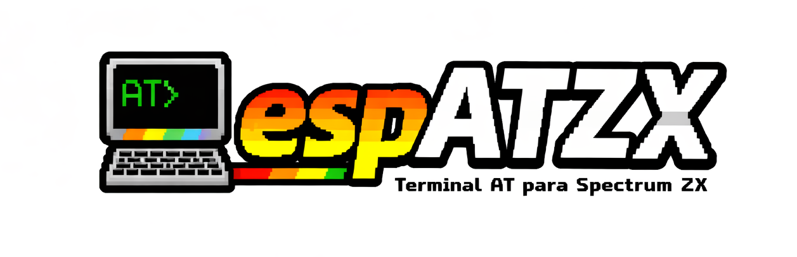

<p align="center">
  
</p>

# ESPAT-ZX: Terminal AT para ZX Spectrum

**Versión 1.0** | [Read in English](README.md)

Terminal de comandos AT completo para ZX Spectrum con módulos WiFi ESP8266/ESP-12. Incluye pantalla de 64 columnas, barra de estado en tiempo real, historial de comandos e inicialización inteligente.


## Índice

- [Características](#características)
- [Requisitos de Hardware](#requisitos-de-hardware)
- [Instalación](#instalación)
- [Compilación](#compilación)
- [Uso](#uso)
  - [Comandos Integrados](#comandos-integrados)
  - [Comandos AT](#comandos-at)
  - [Controles de Teclado](#controles-de-teclado)
- [Barra de Estado](#barra-de-estado)
- [Detalles Técnicos](#detalles-técnicos)
- [Orígenes y Créditos](#orígenes-y-créditos)
- [Licencia](#licencia)

## Características

### Pantalla
- **Pantalla de 64 columnas** usando una fuente personalizada de 4 píxeles de ancho (vs 32 columnas estándar)
- **Interfaz de tres zonas**: Banner (arriba), Área de salida principal (desplazable), Zona de entrada (abajo)
- **Barra de estado en tiempo real** mostrando IP, versión del firmware AT, SSID, barras de señal, hora e indicador de conexión
- **Salida con colores**: Comandos del usuario (blanco brillante), respuestas del ESP (amarillo brillante), mensajes locales (verde brillante), información de depuración (cian)
- **Desplazamiento suave** en el área de salida principal con ajuste automático de línea

### Gestión WiFi
- **Inicialización inteligente**: Detecta automáticamente conexiones WiFi existentes y omite pasos innecesarios
- **Indicador visual de señal**: Display de 4 barras RSSI con gradiente de color (rojo a verde)
- **Auto-actualización**: Actualiza periódicamente el estado de conexión y la intensidad de señal en segundo plano
- **Escaneo de redes**: Lista todas las redes WiFi disponibles con tipo de cifrado e intensidad de señal
- **Sincronización horaria NTP**: Obtiene la hora actual de múltiples servidores de tiempo (pool.ntp.org, time.google.com)

### Sistema de Entrada
- **Edición completa de línea**: Insertar/borrar caracteres en cualquier posición, movimiento del cursor (izquierda/derecha/inicio/fin)
- **Historial de comandos**: Navega por los 6 comandos anteriores con las flechas ARRIBA/ABAJO
- **Manejo inteligente de mayúsculas**: Los comandos se convierten a mayúsculas, los argumentos preservan las mayúsculas originales (¡importante para contraseñas!)
- **Soporte para cadenas entrecomilladas**: El texto entre comillas siempre preserva las mayúsculas/minúsculas
- **Repetición rápida de teclas**: Retroceso optimizado con retardo inicial corto y velocidad de repetición rápida
- **Cursor visual**: Cursor de subrayado que muestra claramente el punto de inserción

### Comunicación
- **UART por bit-banging AY-3-8912**: Comunicación fiable a 9600 baudios a través de los puertos I/O del chip de sonido
- **Buffer circular de 256 bytes**: Previene pérdida de datos durante operaciones lentas de pantalla (desplazamiento, etc.)
- **Filtrado de ruido asíncrono**: Filtra automáticamente mensajes de estado del ESP (WIFI CONNECTED, WIFI GOT IP, etc.)
- **Modo depuración**: Activa la visibilidad de toda la comunicación cruda del ESP para solución de problemas

## Requisitos de Hardware

### Mínimo
- **ZX Spectrum** 48K o superior (48K/128K/+2/+2A/+2B/+3)
- **Módulo WiFi ESP8266 o ESP-12** con firmware AT v1.7+
- **Interfaz AY-UART** conectando el ESP a los puertos I/O del AY-3-8912

### Configuraciones Probadas
- ZX Spectrum 48K + ESP-12F vía placa AY-UART personalizada
- ZX Spectrum 128K +2 + ESP8266-01 vía adaptador de puerto de joystick
- ZX Spectrum +3 + ESP-12E con cableado directo

### Esquema de Conexión

El módulo ESP se conecta a través de los puertos I/O del chip de sonido AY-3-8912. El cableado exacto depende de tu interfaz:

| Pin ESP | Función | Notas |
|---------|---------|-------|
| TX | Datos hacia el Spectrum | Conectar a entrada del Puerto A del AY |
| RX | Datos desde el Spectrum | Conectar a la salida apropiada |
| VCC | Alimentación | 3.3V regulados (¡NO 5V!) |
| GND | Tierra | Tierra común con el Spectrum |
| CH_PD/EN | Habilitación del chip | Conectar a 3.3V |
| GPIO0 | Modo de arranque | Dejar flotante o conectar a alto para operación normal |

> ⚠️ **Advertencia**: El ESP8266 es un dispositivo de 3.3V. Usar 5V lo dañará permanentemente. Usa conversores de nivel o divisores resistivos si es necesario.

## Instalación

### Binario Pre-compilado

1. Descarga `ESPATZX.tap` de la página de [Releases](../../releases)
2. Cárgalo en tu ZX Spectrum usando tu método preferido:

**Hardware Real:**
- **DivMMC/DivIDE**: Copia a la tarjeta SD, navega y carga
- **ESXDOS**: Copia a la tarjeta SD, usa `.tapein` o el navegador NMI
- **TZXDuino/CASDuino**: Reproduce el archivo TAP como audio

**Emuladores:**
- **FUSE**: Archivo → Abrir y selecciona el archivo TAP
- **ZEsarUX**: Carga inteligente o navegador de cinta
- **Spectaculator**: Archivo → Abrir TAP

> 💡 **Consejo**: Para probar características WiFi en emulador, necesitarás emulación de hardware o un módulo ESP real conectado vía paso de puerto serie.

## Compilación

### Requisitos Previos

Instala el compilador cruzado [z88dk](https://github.com/z88dk/z88dk):

**Ubuntu/Debian:**
```bash
sudo apt-get install z88dk
```

**macOS (Homebrew):**
```bash
brew install z88dk
```

**Windows:**
Descarga de [releases de z88dk](https://github.com/z88dk/z88dk/releases) y añade al PATH.

### Compilación

```bash
# Clonar el repositorio
git clone https://github.com/tuusuario/espat-zx.git
cd espat-zx

# Compilar (produce ESPATZX.tap)
make

# Limpiar archivos generados
make clean
```

### Salida de Compilación

```
ESPATZX.tap    - Archivo de cinta cargable para ZX Spectrum
ESPATZX.bin        - Binario crudo (intermedio)
```

### Archivos Fuente

| Archivo | Tamaño | Descripción |
|---------|--------|-------------|
| `espatzx_code.c` | ~66KB | Código fuente principal de la aplicación |
| `ay_uart.asm` | ~4KB | Driver UART en ensamblador Z80 por bit-banging |
| `font64_data.h` | ~12KB | Datos de fuente de 4×8 píxeles (256 caracteres) |
| `font64.bin` | 2KB | Binario de fuente compilado |
| `Makefile` | ~1KB | Configuración de compilación |

### Flags del Compilador

```
zcc +zx        - Objetivo ZX Spectrum
-vn            - Sin salida verbosa
-startup=0     - Código de inicio mínimo
-clib=new      - Usar nueva biblioteca C
-create-app    - Generar archivo TAP
```

## Uso

### Primer Inicio

Cuando ESPAT-ZX se carga, realiza inicialización automática:

```
Initializing...
Probing ESP... OK
Checking connection...
Connected: 192.168.1.100
Ready. Type !HELP, !ABOUT or AT cmds
>_
```

Si ya está conectado a WiFi, esto tarda aproximadamente 1-1.5 segundos. De lo contrario, verás "No WiFi connection" y podrás usar `!CONNECT` para unirte a una red.

### Comandos Integrados

Todos los comandos integrados empiezan con `!` y no distinguen mayúsculas/minúsculas (los argumentos preservan las mayúsculas):

#### Comandos de Red

| Comando | Descripción | Ejemplo |
|---------|-------------|---------|
| `!CONNECT ssid,pass` | Conectar a red WiFi | `!CONNECT MiWiFi,Secreto123` |
| `!DISCONNECT` | Desconectar de la red actual | `!DISCONNECT` |
| `!SCAN` | Buscar redes disponibles | `!SCAN` |
| `!IP` | Actualizar/mostrar estado de conexión | `!IP` |
| `!PING [host]` | Hacer ping a un host (por defecto 8.8.8.8) | `!PING google.com` |

**Ejemplos de Conexión:**
```
> !CONNECT RedCasa,MiPassword123
Connecting to 'RedCasa'...
WIFI CONNECTED
WIFI GOT IP
Done. Run !IP to check.

> !SCAN
Scanning...
+CWLAP:(3,"RedCasa",-45,"aa:bb:cc:dd:ee:ff",1)
+CWLAP:(4,"Vecino",-78,"11:22:33:44:55:66",6)
OK
```

#### Comandos de Información

| Comando | Descripción | Salida |
|---------|-------------|--------|
| `!INFO` | Detalles del firmware ESP | Versión AT, versión SDK, fecha de compilación |
| `!MAC` | Dirección MAC del módulo | `+CIFSR:STAMAC,"aa:bb:cc:dd:ee:ff"` |
| `!TIME` | Sincronizar hora vía NTP | Actualiza el reloj en la barra de estado |

#### Comandos de Sistema

| Comando | Descripción | Notas |
|---------|-------------|-------|
| `!RST` | Reinicio hardware del ESP | Tarda unos segundos en reconectar |
| `!BAUD velocidad` | Cambiar velocidad de baudios | ¡Usar con precaución! |
| `!RAW` | Monitor de tráfico crudo | Pulsa ESPACIO para salir |
| `!DEBUG` | Activar/desactivar modo depuración | Muestra todo el tráfico del ESP |
| `!CLS` | Limpiar pantalla principal | Mantiene la barra de estado |
| `!HELP` / `!?` | Mostrar ayuda (2 páginas) | ESPACIO para página 2 |
| `!ABOUT` | Créditos y versión | Pulsa cualquier tecla para salir |

### Comandos AT

Escribe comandos AT estándar del ESP8266 directamente (se envían tal cual al módulo ESP):

**Básicos:**
```
AT                              Probar comunicación (debería responder "OK")
AT+RST                          Reinicio por software
AT+GMR                          Información de versión
```

**WiFi:**
```
AT+CWMODE=1                     Establecer modo estación
AT+CWJAP="SSID","contraseña"    Conectar a AP
AT+CWQAP                        Desconectar
AT+CWLAP                        Listar puntos de acceso
AT+CIFSR                        Obtener IP local
```

**TCP/IP:**
```
AT+CIPSTART="TCP","host",puerto  Abrir conexión TCP
AT+CIPSEND=longitud              Enviar datos
AT+CIPCLOSE                      Cerrar conexión
AT+CIPMUX=0                      Modo conexión única
AT+CIPMUX=1                      Conexiones múltiples
```

**Hora:**
```
AT+CIPSNTPCFG=1,0,"pool.ntp.org"   Configurar NTP
AT+CIPSNTPTIME?                    Obtener hora actual
```

### Controles de Teclado

| Tecla | Acción |
|-------|--------|
| **←** (CS+5) | Mover cursor a la izquierda |
| **→** (CS+8) | Mover cursor a la derecha |
| **↑** (CS+7) | Comando anterior en historial |
| **↓** (CS+6) | Comando siguiente en historial |
| **DELETE** (CS+0) | Borrar carácter antes del cursor |
| **ENTER** | Ejecutar comando |
| **INICIO** (CS+1) | Saltar al inicio de la línea |
| **FIN** (CS+2) | Saltar al final de la línea |

**Temporización de Repetición de Teclas:**
- Teclas normales: 400ms de retardo inicial (previene dobles)
- Retroceso: 240ms de retardo inicial, luego 50 caracteres/segundo
- Teclas de cursor: 300ms de retardo inicial, luego 25 movimientos/segundo
- Historial: 400ms de retardo inicial, luego 10 elementos/segundo

## Barra de Estado

La barra de estado proporciona información de un vistazo sobre tu conexión:

```
IP:192.168.1.100 AT:1.7.4 SSID:MiRed         ▂▄▆█ 17:30  ●
```

### Campos

| Campo | Ancho | Descripción |
|-------|-------|-------------|
| IP | 15 chars | Dirección IP actual o "---" |
| AT | 7 chars | Versión del firmware AT del ESP |
| SSID | 14 chars | Nombre de red (truncado con ~) |
| Barras | 4 barras | Visualización de intensidad de señal |
| Hora | 5 chars | HH:MM después de sincronización NTP |
| Indicador | 1 char | Punto de estado de conexión |

### Barras de Intensidad de Señal

El indicador de 4 barras representa el RSSI (Indicador de Intensidad de Señal Recibida):

| Barras | Rango RSSI | Calidad |
|--------|------------|---------|
| ▂▄▆█ (4) | > -50 dBm | Excelente |
| ▂▄▆░ (3) | -50 a -60 | Buena |
| ▂▄░░ (2) | -60 a -70 | Regular |
| ▂░░░ (1) | -70 a -80 | Débil |
| ░░░░ (0) | < -80 dBm | Muy débil |

### Colores del Indicador de Conexión

| Color | Significado |
|-------|-------------|
| 🟢 Verde | Conectado a WiFi con IP |
| 🔴 Rojo | No conectado |
| 🟡 Amarillo | Verificando/conectando |

## Detalles Técnicos

### Mapa de Memoria

```
0x4000-0x57FF  Bitmap de pantalla (6144 bytes)
0x5800-0x5AFF  Atributos de color (768 bytes)
0x5B00-0x5BFF  Buffer circular (256 bytes)
0x5C00+        Código y datos de la aplicación
```

### Distribución de Pantalla

```
Línea 0       Banner "ESPAT-ZX: AT Terminal..."  [Fondo azul]
Línea 1       Separador                          [Negro]
Líneas 2-19   Zona de salida principal (18 líneas)  [Fondo negro]
Línea 20      Barra de estado                    [Fondo blanco]
Línea 21      Separador                          [Negro]
Líneas 22-24  Zona de entrada (3 líneas)         [Fondo verde]
```

### Especificaciones de Pantalla

| Propiedad | Valor |
|-----------|-------|
| Columnas | 64 (caracteres de 4 píxeles) |
| Filas | 24 (8 píxeles estándar) |
| Tamaño de fuente | 4×8 píxeles |
| Colores | 8 colores × brillo = 16 |
| Juego de caracteres | ASCII completo de 256 |

### Implementación UART

- **Método**: Bit-banging por software vía puertos I/O del AY-3-8912
- **Velocidad**: 9600 bps (por defecto, configurable)
- **Formato**: 8N1 (8 bits de datos, sin paridad, 1 bit de parada)
- **Buffer**: Buffer circular de 256 bytes
- **Protección de desbordamiento**: Deja de leer cuando el buffer está lleno

### Buffer Circular

```c
#define RING_BUFFER_SIZE 256
static uint8_t ring_buffer[RING_BUFFER_SIZE];
static uint8_t rb_head = 0;  // Posición de escritura
static uint8_t rb_tail = 0;  // Posición de lectura
```

El buffer circular almacena datos UART entrantes, permitiendo al bucle principal procesarlos a su propio ritmo sin perder bytes.

### Constantes de Timeout

```c
#define TIMEOUT_FAST  25000UL   // Consultas rápidas (AT, CIFSR)
#define TIMEOUT_STD   200000UL  // Comandos normales
#define TIMEOUT_LONG  500000UL  // SCAN, CONNECT
```

### Mensajes Asíncronos Filtrados

El parser oculta automáticamente estos mensajes de estado del ESP:

- `WIFI CONNECTED`, `WIFI GOT IP`, `WIFI DISCONNECT`
- `CONNECT`, `CLOSED` (eventos de conexión TCP)
- `+IPD,...` (notificaciones de datos entrantes)
- IDs de conexión (dígitos simples/dobles)
- `busy p...`, `busy s...`
- `ready` (después de reinicio)
- Marcadores de protocolo propietario (`LAIN`, `WFXR`)

Usa `!DEBUG` para ver todos los mensajes incluyendo los filtrados.

## Orígenes y Créditos

### Historia

ESPAT-ZX comenzó como un fork de **esp-terminal** de Vasily Khoruzhick (anarsoul), un terminal básico para enviar comandos AT a un ESP8266 desde un ZX Spectrum.

Este proyecto expandió significativamente el original con:

- Rediseño completo de UI con pantalla de 64 columnas
- Barra de estado en tiempo real con múltiples campos de datos
- Visualización de intensidad de señal
- Historial de comandos con navegación
- Capacidades completas de edición de línea
- Inicialización inteligente y auto-detección
- Extenso filtrado de mensajes asíncronos
- Sincronización de hora NTP
- Comandos integrados de alto nivel
- Rendimiento y temporización optimizados

### Herencia de Código

Porciones de código derivadas de:

- **esp-terminal** de anarsoul - Concepto original del terminal AT y básicos de AY-UART
- **BridgeZX** - Protocolos de transferencia de archivos WiFi y patrones de comunicación ESP
- **NetManZX** - Rutinas de gestión de red y conceptos de visualización de estado

### Autor

**ESPAT-ZX v1.0**
© 2025 M. Ignacio Monge Garcia

### Agradecimientos

- El equipo de z88dk por el excelente compilador cruzado
- La comunidad del ZX Spectrum por mantener viva la plataforma
- Espressif por el ESP8266 y el firmware AT

## Licencia

Este proyecto se publica bajo la Licencia MIT.

```
MIT License

Copyright (c) 2025 M. Ignacio Monge Garcia

Permission is hereby granted, free of charge, to any person obtaining a copy
of this software and associated documentation files (the "Software"), to deal
in the Software without restriction, including without limitation the rights
to use, copy, modify, merge, publish, distribute, sublicense, and/or sell
copies of the Software, and to permit persons to whom the Software is
furnished to do so, subject to the following conditions:

The above copyright notice and this permission notice shall be included in all
copies or substantial portions of the Software.

THE SOFTWARE IS PROVIDED "AS IS", WITHOUT WARRANTY OF ANY KIND, EXPRESS OR
IMPLIED, INCLUDING BUT NOT LIMITED TO THE WARRANTIES OF MERCHANTABILITY,
FITNESS FOR A PARTICULAR PURPOSE AND NONINFRINGEMENT. IN NO EVENT SHALL THE
AUTHORS OR COPYRIGHT HOLDERS BE LIABLE FOR ANY CLAIM, DAMAGES OR OTHER
LIABILITY, WHETHER IN AN ACTION OF CONTRACT, TORT OR OTHERWISE, ARISING FROM,
OUT OF OR IN CONNECTION WITH THE SOFTWARE OR THE USE OR OTHER DEALINGS IN THE
SOFTWARE.
```

---

<p align="center">
  <b>ESPAT-ZX v1.0</b><br>
  Conectando el ZX Spectrum con el mundo moderno 🌐
</p>
